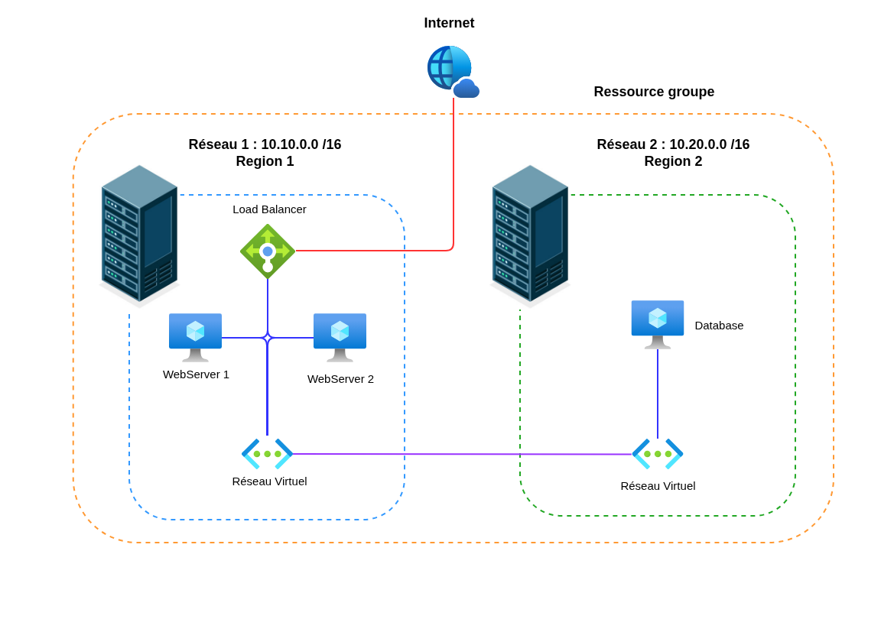
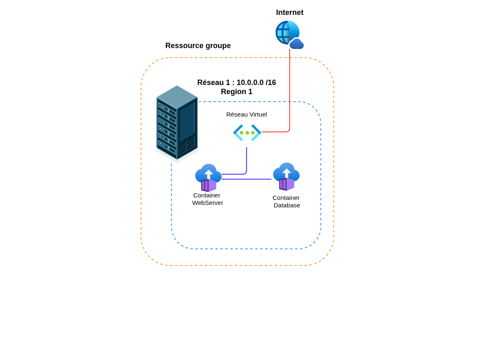

# 🌥️ Terracloud - Schéma Réseau

**Infrastructure Azure - IaaS & PaaS**

---

## 📐 Architecture Réseau Caas

---

## 📋 Informations Infrastructure

| Paramètre            | Valeur         |
|----------------------|----------------|
| **Région Azure 1**   | West Europe    |
| **Région Azure 2**   | France Central |
| **Resource Group**   | rg-terracloud  |
| **Subnet Public**    | -              |
| **Subnet Private 1** | 10.10.0.0 /16  |
| **Subnet Private 2** | 10.20.0.0 /16  |

## 🎨 Légende

 Couleur | Liens                                    |
|---------|------------------------------------------|
| 🔵 Bleu | Liens entre machines et réseaux virtuels |
| 🔴 Rouge | Liens réseau public                      |
| 🟣 Violet | Liens entre deux réseaux privé           |

---

## 📐 Architecture Réseau IaaS

---

## 📋 Informations Infrastructure

| Paramètre            | Valeur         |
|----------------------|----------------|
| **Région Azure 2**   | France Central |
| **Resource Group**   | rg-terracloud  |
| **Subnet Public**    | -              |
| **Subnet Private 1** | 10.10.0.0 /16  |

---

## 🎨 Légende

 Couleur | Liens                                    |
|---------|------------------------------------------|
| 🔵 Bleu | Liens entre machines et réseaux virtuels |
| 🔴 Rouge | Liens réseau public                      |

---

**Projet Terracloud - Infrastructure as Code**

