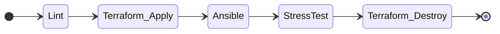
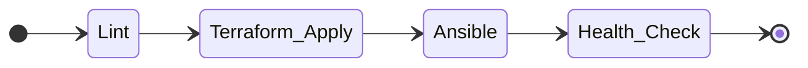

# Documentation architecture

## Git

### Branche Dev

La branche de dev permet au developpeur de tester automatiquement le deploiement de l'application.

### Branche Main

La branche main est la branche qui acceuil le code destiné à la production.

## L'infrastructure

### IAAC

High availability setup

```mermaid
architecture-beta
    group azure(cloud)[azure]

    service db(database)[Database] in azure
    service lb(disk)[Load Balancer] in azure
    service vm1(server)[VM1] in azure
    service vm2(server)[VM2] in azure
    service user(person)[User]
    service consul(consul)[Consul] in azure
    lb:R -- L:vm1
    lb:R -- L:vm2
    vm1:R -- L:db
    vm2:R -- L:db
    user:R -- L:lb


```



### PAAC

## La CI

### IAAC

#### Dev

#### Prod

### PAAC

## Stratégie de livraison

### Les tags

Lorsque la branche de dev est merge dans main, un tag doit être créer afin de lancer un deploiement sur l'infrastructure de prod.

### Les versions 

Les version se font selon le format suivant:

```
MAJEUR.MINEUR.CORRECTIF
```

### Exemples

1.0.0 → première version stable

1.1.0 → ajout d’une nouvelle feature compatible

1.1.1 → correctif d’un bug mineur

2.0.0 → rupture de compatibilité (nouvelle architecture, API modifiée, etc.)