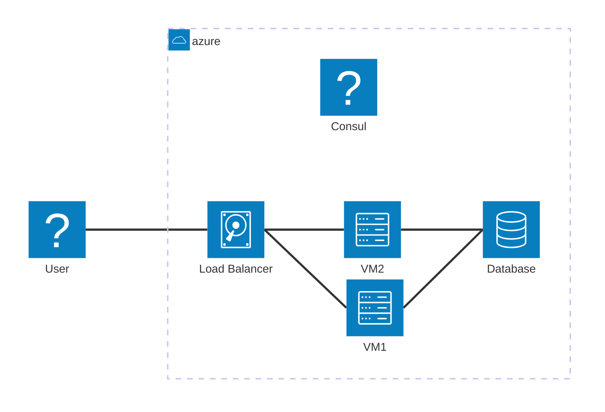
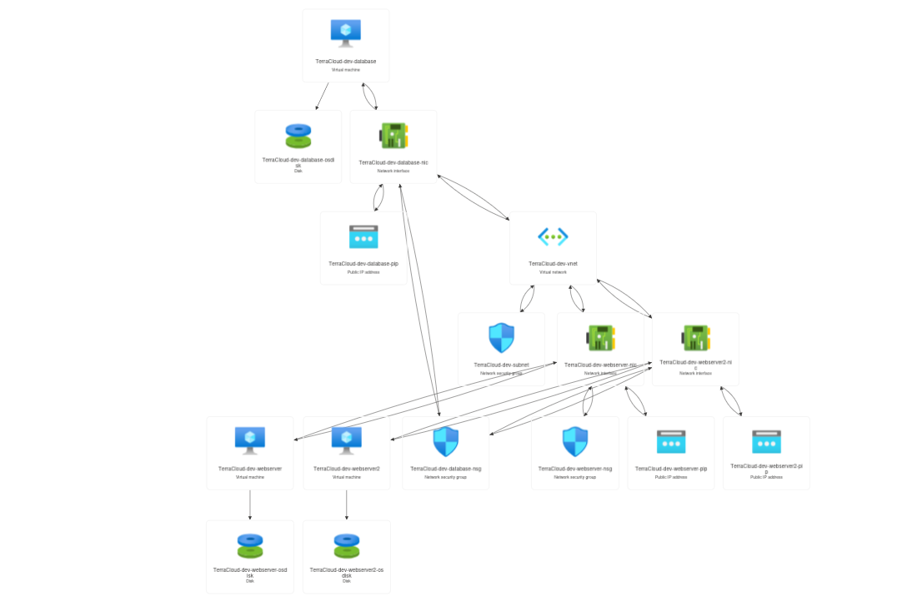
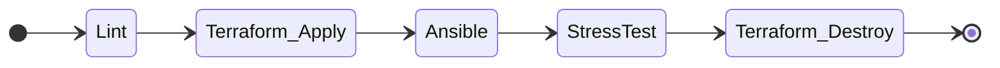
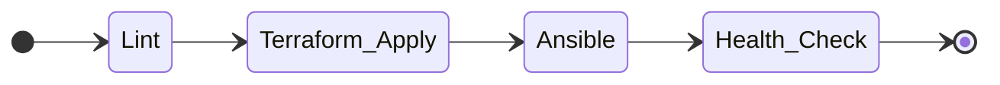
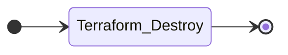

# L'infrastructure

## IAAC

High availability setup

```mermaid
architecture-beta
    group azure(cloud)[azure]

    service db(database)[Database] in azure
    service lb(disk)[Load Balancer] in azure
    service vm1(server)[VM1] in azure
    service vm2(server)[VM2] in azure
    service user(person)[User]
    service consul(consul)[Consul] in azure
    lb:R -- L:vm1
    lb:R -- L:vm2
    vm1:R -- L:db
    vm2:R -- L:db
    user:R -- L:lb
```
## Terraform

***SANS LB***

# La CI

## IAAC

### Dev

```mermaid
stateDiagram-v2
    direction LR
    [*] --> Lint
    Lint --> Terraform_Apply
    Terraform_Apply --> Ansible
    Ansible --> StressTest
    StressTest --> Terraform_Destroy
    Terraform_Destroy --> [*]
```
### Prod

#### Deploy (auto)

```mermaid
stateDiagram-v2
    direction LR
    [*] --> Lint
    Lint --> Terraform_Apply
    Terraform_Apply --> Ansible
    Ansible --> Health_Check
    Health_Check --> [*]

```

#### Destroy (manual)

```mermaid
    stateDiagram-v2
    direction LR
    [*] --> Terraform_Destroy
    Terraform_Destroy --> [*]
```