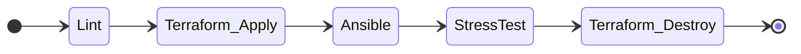
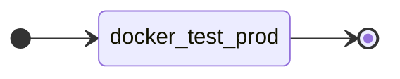
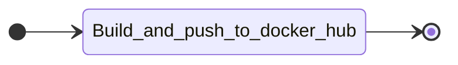
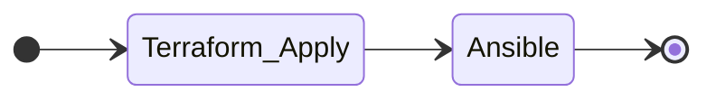
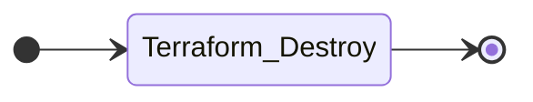

# L'infrastructure

## IAAC

High availability setup

```mermaid
architecture-beta
    group azure(cloud)[azure]

    service db(database)[Database] in azure
    service lb(disk)[Load Balancer] in azure
    service vm1(server)[VM1] in azure
    service vm2(server)[VM2] in azure
    service user(person)[User]
    service consul(consul)[Consul] in azure
    lb:R -- L:vm1
    lb:R -- L:vm2
    vm1:R -- L:db
    vm2:R -- L:db
    user:R -- L:lb
```

## Terraform

***SANS LB***

# La CI

## IAAC

### Dev

#### ON Pull Request TO Dev

Les PR vers "dev" passent une serie de tests

#### ON Pull Request FROM DEV TO MAIN

Quand on veux merge "dev" vers "main" un test qui lance le docker compose de prod est lancé

### Prod
#### ON Push TO Main

Une fois que dev est merge dans main, on push l'image de l'application sur Dockerhub afin d'accelerer la mise en production en evitant le build
#### Deploy (auto)

A la création du TAG, on deploie l'infrastructure de prod
#### Destroy (manual)

Cette action est à executer quand on souhaite detruire la prod 